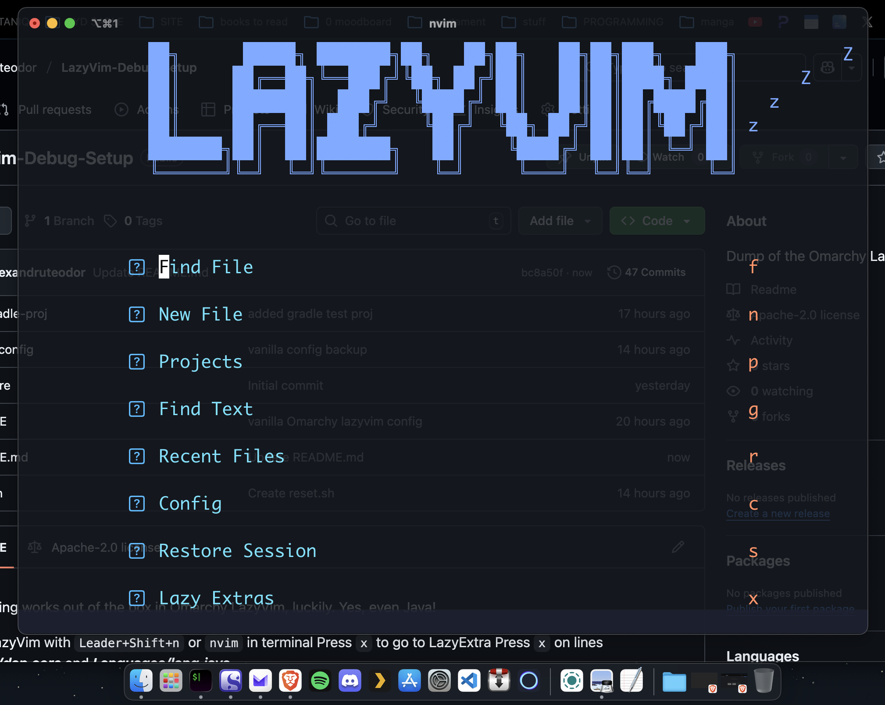

<p align="center"></p>

Debugging works out of the box in Omarchy LazyVim, luckily. Yes, even Java!

Open LazyVim with `Leader+Shift+n` or `nvim` in terminal
Press `x` to go to LazyExtra
Press `x` on lines ***Plugins/dap.core*** and ***Languages/lang.java***

You need a pom.xml, gradle.build or .git to debug
Open debug menu with `Leader+d`, b is to toggle breakpoint, c to launch/continue, but you also have a debug CLI!

## Brew installs

Brew
``` /bin/bash -c "$(curl -fsSL https://raw.githubusercontent.com/Homebrew/install/HEAD/install.sh)" ```

OpenJdk

``` brew install openjdk ```

